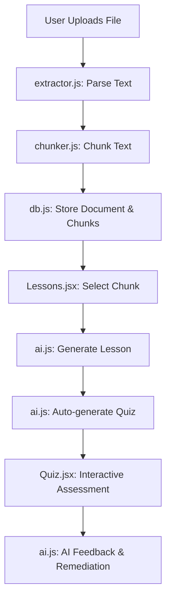

# Architecture Overview: AI Learning Assistant

This document describes the high-level architecture of the **AI Learning Assistant** (ALA), a local-first, AI-powered study platform.

## System Design Principles
1. **Local-First**: All user data, documents, and generated content are stored in the user's browser (IndexedDB & LocalStorage). No backend server is required (except for AI API calls).
2. **AI-Centric**: Every lesson and quiz is dynamically generated based on user-provided content.
3. **Premium UX**: High-fidelity UI using Tailwind CSS, Framer Motion, and Lucide Icons.

## Core Components

### 1. Document Extraction Layer (`src/services/`)
- **`extractor.js`**: Handles text extraction from various file formats (.txt, .pdf, .docx). Uses `pdfjs-dist` for PDFs and `mammoth` for DOCX.
- **`chunker.js`**: Splits large texts into manageable pieces (chunks) to respect AI context windows and allow focused learning.

### 2. AI Integration Layer (`src/api/`)
- **`ai.js`**: Centralized logic for interacting with Large Language Models (LLMs).
- **Core Functions**:
  - `generateLessonOutline`: Creates structured study notes.
  - `generateQuiz`: Generates interactive multiple-choice questions.
  - `getQuizFeedback`: Provides personalized remediation and extra questions based on performance.

### 3. Persistence Layer (`src/persistence/`)
- **`db.js`**: Managed IndexedDB instance (using `dexie` or native IDB) for storing large file blobs and extracted text.
- **`storage.js`**: Wrapper for `localStorage` to store lightweight metadata:
  - API Keys
  - Lesson Outlines
  - Quiz Questions
  - Quiz Results (Scores)

### 4. UI Layer (`src/pages/` & `src/components/`)
- **React Router**: Manages navigation between Dashboard, Documents, Lessons, and Quizzes.
- **Framer Motion**: Handles all kinetic typography, glassmorphism transitions, and physics-based animations.

## Main User Flow

## Tech Stack
- **Frontend**: React (Vite)
- **Styling**: Tailwind CSS v4
- **Animations**: Framer Motion
- **Icons**: Lucide React
- **Storage**: IndexedDB (Blobs) + LocalStorage (JSON)
- **AI**: Gemini API / OpenAI compatible
